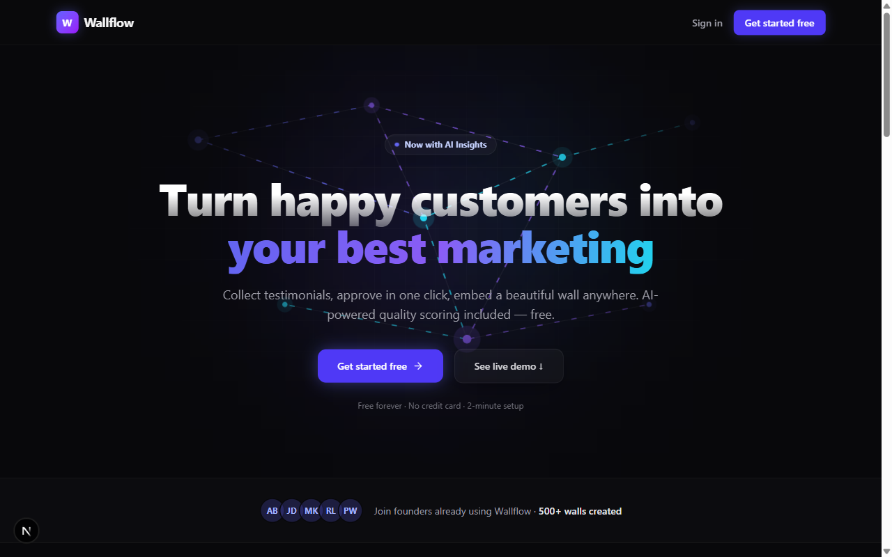
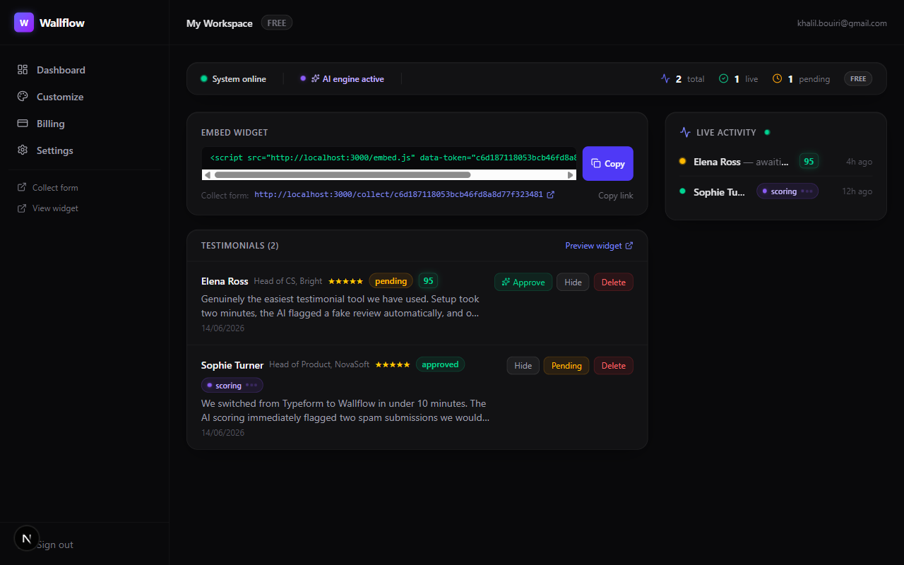

# Wallflow — Embeddable Testimonial Widget SaaS

AI-powered testimonial collection, moderation, and embedding.
Multi-tenant SaaS built with Next.js 16, Supabase, Stripe and Gemini. Production-ready.



## 🚀 Live demo

**https://wallflow-one.vercel.app**

- Landing page with a real, embedded wall of love
- Public widget: `https://wallflow-one.vercel.app/widget/cafecafe000000000000000000000000`
- Public collect form: `https://wallflow-one.vercel.app/collect/cafecafe000000000000000000000000`

### Dashboard — AI scoring, live activity & insights



## Setup in 5 minutes

1. Clone repo
2. `cp .env.example .env.local` — fill in values
3. Run `supabase/schema.sql` in the Supabase SQL Editor
4. Run `supabase/migration_ai_scores.sql` in the Supabase SQL Editor
5. `npm install && npx tsx --env-file=.env.local scripts/seed.ts`
6. `npm run dev` → http://localhost:3000

## Get a free Gemini API key

https://aistudio.google.com → "Get API Key" → free tier.
Add it to `.env.local`:

```
GEMINI_API_KEY=your_key_here
```

> Note: the app uses the `gemini-2.5-flash` model. AI scoring degrades gracefully
> (testimonials still save, `ai_score` stays empty) if the key is absent or rate-limited.

## Stack

Next.js 16 (App Router) · TypeScript strict · Tailwind v4 · Framer Motion · Supabase · Stripe · Gemini 2.5 Flash

## Features

- Public collection form (shareable link per workspace)
- AI quality scoring per testimonial (Gemini 2.5 Flash — free tier)
- AI Insights panel (themes, sentiment, one-liner, cached 1h, streamed via Suspense)
- Embeddable widget (iframe, 3 layouts: grid / carousel / single, auto-height)
- Stripe Checkout (Free → Pro) with subscription lifecycle webhooks (upgrade + downgrade)
- Multi-tenant Row-Level Security (Supabase)
- XSS-safe (sanitized inputs, plain-text rendering, no `dangerouslySetInnerHTML`)
- Atomic rate limiting (10 req/min per IP, Postgres function)
- Dark, responsive UI with mobile navigation

## Monetization

| Plan | Price    | Limits |
|------|----------|--------|
| Free | €0/mo    | 10 testimonials, watermark, grid layout |
| Pro  | €19/mo   | Unlimited, no watermark, all layouts, custom accent color, full AI Insights |

## Routes

| Route | Description |
|-------|-------------|
| `/` | Landing page |
| `/login` | Sign in / Sign up |
| `/dashboard` | Testimonials table + AI scores + Insights |
| `/customize` | Widget layout / color / watermark |
| `/billing` | Stripe Checkout |
| `/settings` | Workspace name, API key status |
| `/collect/[token]` | Public submission form |
| `/widget/[token]` | Embeddable widget (iframe target) |

## Embed snippet

```html
<script src="https://wallflow-one.vercel.app/embed.js" data-token="<your-token>" async></script>
```

## Deploy to Vercel

1. Push to GitHub (no `.env.local` — it is gitignored)
2. Import the repo in Vercel
3. Add the env vars from `.env.example`
4. Set `NEXT_PUBLIC_APP_URL` to your production URL
5. Run `supabase/schema.sql` and `supabase/migration_ai_scores.sql` on your Supabase project

## Security

- All user content HTML-stripped on input, rendered as plain text
- Avatar URLs validated as `https://` only (no `javascript:` / `data:`)
- Atomic rate limiting: 10 req/min per IP+token → HTTP 429
- Token validation: 32-char hex regex on every public route
- Widget CSP: `frame-ancestors *`, `img-src https:`
- Stripe webhooks: signature verification with `STRIPE_WEBHOOK_SECRET`
- Zero hardcoded secrets — all via `process.env`
